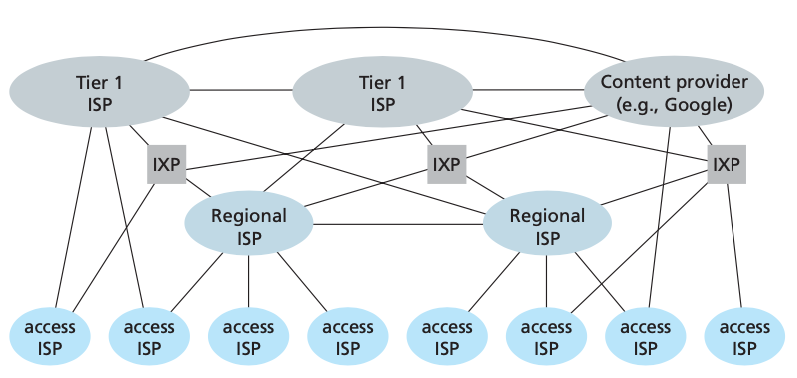
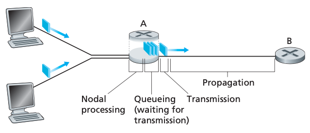
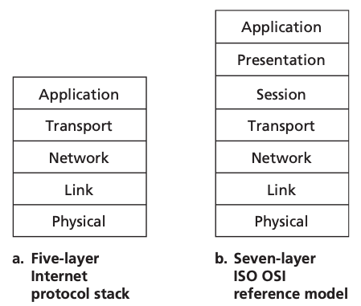
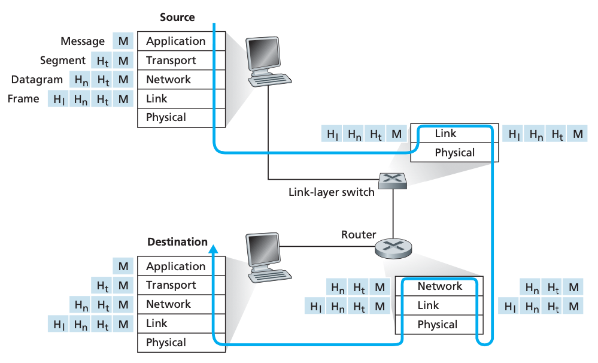

# Chapter 1 Computer Networks and the Internet

## What Is the Internet?

### A Nuts-and-Bolts Description

* All devices are called **hosts** or **end** systems
* End systems are connected together by a network of **communication links** and **package switches**
* Different links can transmit data at different rates, with the **transmission rate** of a link measured in bits/second
* When one end system has data to send to another end system, the sending end system segments the data and adds header bytes to each segment
  * The resulting packages of information, known as **packets** in the jargon of computer networks, are then sent through the network to the destination end system, where they are reassembled into the original data
  * A packet switch takes a packet arriving on one of its incoming communication links and forwards that packet on one of its outgoing communication links
    * routers - network core
    * link-layer switches - access networks
* The sequence of communication links and packet switches traversed by a packet from the sending end system to the receiving end system is known as a **route** or **path** through the network
* End systems access the Internet through **Internet Service Providers (ISPs)**
  * Each ISP is in itself a network of packet switches and communication links
  * Each ISP network, whether upper-tier or lower-tier, is managed independently, runs the IP protocol, and conforms to certain naming and address conventions
* End systems, packet switches, and other pieces of the Internet run **protocols** that control the sending and receiving of information within the Internet
  * The **Transmission Control Protocol (TCP)** and the **Internet Protocol (IP)** are two of the most important protocols in the Internet
* **Internet standards** are developed by the Internet Engineering Task Force (IETF)
  * The IETF standards documents are called **requests for comments (RFCs)**

### A Services Description

* Applications are said to be **distributed applications**, since they involve multiple end systems that exchange data with each other
* End systems attached to the Internet provide an **Application Programming Interface (API)** that specifies how a program running on one end system asks the Internet infrastructure to deliver data to a specific destination program running on another end system
  * This Internet API is a set of rules that the sending program must follow so that the Internet can deliver the data to the destination program

### What Is a Protocol?

* It takes two (or more) communicating entities running the same protocol in order to accomplish a task
* *A* **protocol** defines the format and the order of messages exchanged between two or more communicating entities, as well as the actions taken on the transmission and/or receipt of a message or other event

## The Network Edge

* Host = End System
* Hosts are divided into **clients** and **servers**

### Access Networks

* Networks physically connects an end system to the first router (a.k.a. "edge router") on a path from the end system to any other distant end system
* **Digital subscriber line** (DSL) and **cable** are two most prevalent types of broadband residential access
* Cable Internet access makes use of the cable television company’s existing cable television infrastructure
  * Requires special models, called cable modems
  * Every packet sent by the head end travels downstream on every link to every home and every packet sent by a home travels on the upstream channel to the head end
* At the cable head end, the cable modem termination system (CMTS) serves a similar function as the DSL network’s DSLAM—turning the analog signal sent from the cable modems in many downstream homes back into digital format. Cable modems divide the HFC network into two channels, a downstream and an upstream channel
  * As with DSL, access is typically asymmetric
* **Fiber to the home** (FTTH) provide an optical fiber path from the central office directly to the home
* **Local area network** (LAN) is used to connect an end system to the edge router
  * Ethernet is most prevalent access technology of LAN
  * Wireless LAN access based on IEEE 802.11, a.k.a. **WIFI**
  * **Long-Term Evolution** (LTE) has its roots in 3G

### Physical Media

* For each transmitter-receiver pair, the bit is sent by propagating electromagnetic waves or optical pulses across a **physical medium**
* Physical media fall into two categories: **guided media** and **unguided media**
* With guided media, the waves are guided along a solid medium, such as a fiber-optic cable, a twisted-pair copper wire, or a coaxial cable
* With unguided media, the waves propagate in the atmosphere and in outer space, such as in a wireless LAN or a digital satellite channel
* **Twisted-Pair Copper Wire**
  * The least expensive and most commonly used guided transmission medium is twisted-pair copper wire
  * A wire pair constitutes a single communication link
  * Unshielded twisted pair (UTP) is commonly used for computer networks within a building, that is, for LANs
* **Coaxial Cable**
  * Like twisted pair, coaxial cable consists of two copper conductors, but the two conductors are concentric rather than parallel
  * Coaxial cable can be used as a guided **shared medium**
* **Fiber Optics**
  * An optical fiber is a thin, flexible medium that conducts pulses of light, with each pulse representing a bit
  * Fiber optics is the preferred long-haul guided transmission media, particularly for overseas links.
* **Terrestrial Radio Channels**
  * Radio channels carry signals in the electromagnetic spectrum
* **Satellite Radio Channels**
  * A communication satellite links two or more Earth-based microwave transmitter/receivers, known as ground stations

## The Network Core

### Packet Switching

* End systems exchange **messages** with each other
* Messages may perform a control function or can contain data
* To send a message from a source end system to a destination end system, the source breaks long messages into smaller chunks of data known as **packets**
* Packets are transmitted over each communication link at a rate equal to the full transmission rate of the link
* **Store-and-Forward Transmission**
  * The packet switch must receive the entire packet before it can begin to transmit the first bit of the packet onto the outbound link
* **Queuing Delays and Packet Loss**
  * For each attached link, the package switch has an **output buffer**, which stores packets that the router is about to send into that link
  * Since the amount of buffer space is finite, an arriving packet may find that the buffer is completely full with other packets waiting for transmission
  * In this case, **packet loss** will occur—either the arriving packet or one of the already-queued packets will be dropped
* **Forwarding Tables and Routing Protocols**
  * Every end system has an address called an IP address
  * When a source end system wants to send a packet to a destination end system, the source includes the destination’s IP address in the packet’s header
  * Each router has a **forwarding table** that maps destination addresses (or portions of the destination addresses) to that router’s outbound links

### Circuit Switching

* There are two fundamental approaches to moving data through a network of links and switches: **circuit switching** and **packet switching**
* In circuit-switched networks, the resources needed along a path (buffers, link transmission rate) to provide for communication between the end systems are reserved for the duration of the communication session between the end systems
  * When the network establishes the circuit, it also reserves a constant transmission rate in the network’s links
* In packet switching, the packet is sent into the network without reserving any link resources whatsoever
  * If one of the links is congested because other packets need to be transmitted over the link at the same time, then the packet will have to wait in a buffer at the sending side of the transmission link and suffer a delay
  * The Internet makes its best effort to deliver packets in a timely manner, but it does not make any guarantees
* **Multiplexing in Circuit-Switched Networks**
  * A circuit in a link is implemented with either **frequency-division multiplexing (FDM)** or **time-division multiplexing (TDM)**
  * Proponents of packet switching have always argued that circuit switching is wasteful because the dedicated circuits are idle during **silent periods**
  * Proponents of packet switching also enjoy pointing out that establishing end-to-end circuits and reserving end-to-end transmission capacity is complicated and requires complex signaling software to coordinate the operation of the switches along the end-to-end path

### A Network of Networks

## Delay, Loss, and Throughput in Packet-Switched Networks

### Overview of Delay in Packet-Switched Networks

* The most important of delays are the nodal processing delay, queuing delay, transmission delay, and propagation delay; together, these delays accumulate to give a total nodal delay
* **Processing Delay**
  * The time required to examine the packet’s header and determine where to direct the packet
* **Queuing Delay**
  * At the queue, the packet experiences a **queuing delay** as it waits to be transmitted onto the link
  * The length of the queuing delay of a specific packet will depend on the num- ber of earlier-arriving packets that are queued and waiting for transmission onto the link
* **Transmission Delay**
  * This is the amount of time required to push (that is, transmit) all of the packet’s bits into the link
* **Propagation Delay**
  * The time required to propagate from the beginning of the link to router B

### Queuing Delay and Packet Loss

* Design your system so that the traffic intensity is no greater than 1
* As the traffic intensity approaches 1, the average queuing delay increases rapidly
* **Packet Loss**
  * With no place to store a packet that arrives at a full queue, a router will **drop** that packet; that is, the packet will be **lost**
  * A lost packet may be retransmitted on an end-to-end basis in order to ensure that all data are eventually transferred from source to destination

### End-to-End Delay

* An end system wanting to transmit a packet into a shared medium may purposefully delay its transmission as part of its protocol for shairng the medium with other end systems

### Throughput in Computer Networks

* The **instantaneous throughput** at any instant of time is the rate (in bits/sec) at which Host B is receiving the file
* If the file consists of *F* bits and the transfer takes *T* seconds for Host B to receive all *F* bits, then the **average throughput** of the file transfer is *F/T* bits/sec
* The rate at which bits can flow from source to destination is again the minimum of $R_s$ and $R_c$, that is, throughput = $min\{R_s, R_c\}$

## Protocol Layers and Their Service Models

### Layered Architecture

* **As long as the layer provides the same service to the layer above it, and uses the same services from the layer below it, the remainder of the system remains unchanged when a layer’s implementation is changed**

* **Protocol Layering**
  * To provide structure to the design of network protocols, network designers organize protocols—and the network hardware and software that implement the protocols—in **layers**
  * We are interested in the **services** that a layer offers to the layer above—the so-called **service model** of a layer
    * Performing certain actions within that layer
    * Using the services of the layer directly below it
  * Application-layer protocols—such as HTTP and SMTP—are almost always implemented in software in the end systems; so are transport-layer protocols
  * Because the physical layer and data link layers are responsible for handling communication over a specific link, they are typically implemented in a network interface card associated with a given link
* **Application Layer**
  * HTTP/SMTP/FTP/DNS
  * Distributed over multiple end systems, with the application in one end system using the protocol to exchange packets of information with another
  * **Message**
* **Transport Layer**
  * Transports application-layer messages between application endpoints
  * TCP/UDP
  * **Segment**
* **Network Layer**
  * Responsible for moving network-layer packets known as **datagrams** from one host to another
  * IP
  * The Internet’s network layer also contains routing protocols that determine the routes that datagrams take between sources and destinations
* **Link Layer**
  * Routes a datagram through a series of routers between the source and destination
  * At each node, the network layer passes the datagram down to the link layer, which delivers the datagram to the next node along the route
  * A datagram may be handled by different link-layer protocols at different links along its route
  * **Frames**
* **Physical Layer**
  * Moves the individual bits within the frame from one node to the next

### Encapsulation

* **Encapsulation**
  * At the sending host, an **application-layer message** is passed to the transport layer
  * In the simplest case, the transport layer takes the message and appends additional information that will be used by the receiver-side transport layer
  * The application-layer message and the transport-layer header information together constitute the **transport-layer segment**
  * The transport layer then passes the segment to the network layer, which adds network-layer header information such as source and destination end system addresses, creating a **network-layer datagram**
  * The datagram is then passed to the link layer, which will add its own link-layer header information and create a **link-layer frame**
  * Thus, we see that at each layer, a packet has two types of fields: header fields and a **payload field**

## Networks Under Attack

* **Malware**
  * Self-replicating
  * **Viruses** are malware that require some form of user interaction to infect the user’s device
  * **Worms** are malware that can enter a device without any explicit user interaction
* **Denial-of-service (DoS) attacks** render a network, host, or other piece of infrastructure unusable by legitimate users
  * Web servers, e-mail servers, DNS servers, and institutional networks can all be subject to DoS
  * If all the traffic emanates from a single source, an upstream router may be able to detect the attack and block all traffic from that source before the traffic gets near the server
  * **Distributed DoS (DDoS)** attack leverages botnets with thousands of comprised hosts
* **Packet sniffer** records a copy of every packet that flies by
* **IP spoofing** injects packets into the Internet with a false source address