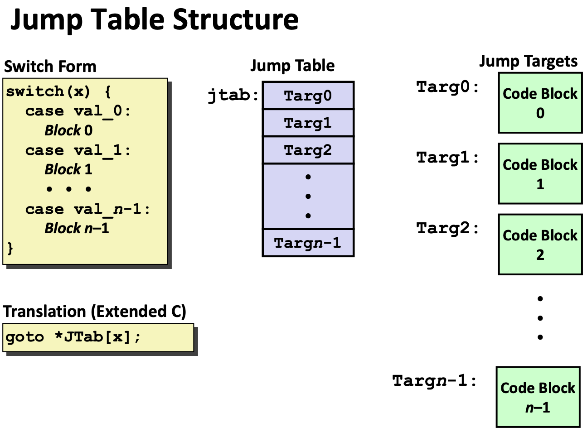

# Lecture 06 Machine-Level Programming II: Control

## Conditional Codes

* **CF**: Carry flag
  * for `unsigned`
  * set if carry/borrow out from most significant bit
* **SF**: Sign flag
  * for `signed`
  * set if `(a-b) < 0`
* **ZF**: Zero flag
  * set if `a == b`
* **OF**: Overflow flag
  * for `signed`
  * `(a > 0 && b < 0 && (a-b) < 0) || (a<0 && b > 0 && (a-b) > 0)`

* Compare
  * `cmpq Src2, Src1`
  * like computing `a - b` without setting destination
* Test
  * `testq Src2, Src1`
  * like computing `a & b` without setting destination
  * Very often: `tests %rax, %rax`
* Set
  * `setX Dest`: set low-order byte of destination `Dest` to 0 or 1 based on combinations of condition codes
  * Does not alter remaining 7 bytes of Dest

## Conditional Branches

* `jX` Instructions
  * Jump to different part of code depending on condition codes
  * Implicit reading of conditional codes
*  `val = Test ? Then_Expr : Else_Expr;`

## Loops

* Do-While

```text
loop:
	Body
  	If (Test)
    	Goto loop
```

* General While

```text
	goto test;
loop:
	Body
test:
	if (Test)
		goto loop;
done:
```

* For Loop

```text
Init;
while (Test) {
	Body;
	Update;
}
```

## Switch



* Jumping
  * Direct: `jmp .L8`
  * Indirect: `jmp *.L4(,%rdi,8)`