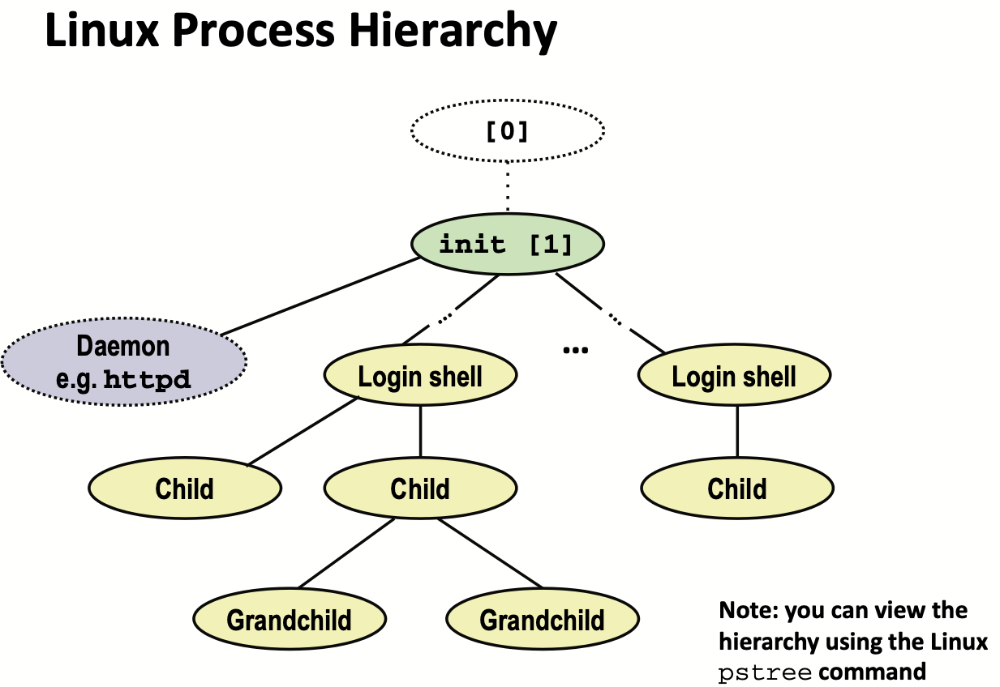

# Lecture 20 Exceptional Control Flow: Signals and Nonlocal Jumps

## Shells

### Linux Process Hierarchy



### Shell Programs

* A **shell** is an application program that runs programs on behalf of the user

## Signals

* A **signal** is a small message that notifies a process that an event of some type has occurred in the system
  * Akin to exceptions and interrupts
  * Sent from the kernel (sometimes at the request of another process) to a process
  * Signal type is identified by small integer ID’s (1-30)
  * Only information in a signal is its ID and the fact that it arrived

| ID   | Name    | Default Action | Corresponding Event                      |
| ---- | ------- | -------------- | ---------------------------------------- |
| 2    | SIGINT  | Terminate      | User typed ctrl-c                        |
| 9    | SIGKILL | Terminate      | Kill program (cannot override or ignore) |
| 11   | SIGSEGV | Terminate      | Segmentation violation                   |
| 14   | SIGALRM | Terminate      | Timer signal                             |
| 17   | SIGCHLD | Ignore         | Child stopped or terminated              |

### Sending a Signal

* Kernel **sends** (delivers) a signal to a **destination process** by updating some state in the context of the destination process
* Kernel sends a signal for one of the following reasons:
  * Kernel has detected a system event such as divide-by-zero (SIGFPE) or the termination of a child process (SIGCHLD)
  * Another process has invoked the `kill` system call to explicitly request the kernel to send a signal to the destination process

### Receiving a Signal

* A destination process **receives** a signal when it is forced by the kernel to react in some way to the delivery of the signal
* Some possible ways to react:
  * **Ignore** the signal (do nothing)
  * **Terminate** the process (with optional core dump)
  * **Catch** the signal by executing a user-level function called signal handler
    * Akin to a hardware exception handler being called in response to an asynchronous interrupt:

### Pending and Blocked Signals

* A  signal is **pending** if sent but not yet received
  * There can be at most one pending signal of any particular type
  * **Signals are not queued**
* A process can **block** the receipt of certain signals
  * Blocked signals can be delivered, but will not be received until the signal is unblocked
* A pending signal is received at most once
* **Kernel maintains pending and blocked bit vectors in the context of each process**
  * Kernel sets bit k in `pending` when a signal of type k is delivered
  * Kernel clears bit k in `pending`when a signal of type k is received
  * `blocked` can be set and cleared by using the sigprocmask function

### Process Groups

* Every process belongs to exactly one process group
* `getpgrp()` - Return process group of current process
* `setpgid()` - Change process group of a process

### Sending Signals from the Keyboard

* Typing ctrl-c (ctrl-z) causes the kernel to send a SIGINT (SIGTSTP) to every job in the foreground process group
  * SIGINT – default action is to terminate each process
  * SIGTSTP – default action is to stop (suspend) each process

### Receiving Signals

* Each signal type has a predefined **default action**, which is one of:
  * The process terminates
  * The process stops until restarted by a SIGCONT signal
  * The process ignores the signal

### Signal Handler

* * `handler_t *signal(int signum, handler_t *handler)`
  * `SIG_IGN`: ignore signals of type signum
  * `SIG_DFL`: revert to the default action on receipt of signals of type signum
  * Otherwise, handler is the address of a user-level **signal handler**
* A signal handler is a separate logical flow (not process) that runs concurrently with the main program
* But, this flow exists only until returns to main program

### Blocking and Unblocking Signals

* Implicit blocking mechanism
  * Kernel blocks any pending signals of type currently being handled
  * e.g., a SIGINT handler can’t be interrupted by another SIGINT
* Explicit blocking and unblocking mechanism
  * `sigprocmask` function

```text
sigset_t mask, prev_mask;
Sigemptyset(&mask);
Sigaddset(&mask, SIGINT);
/* Block SIGINT and save previous blocked set */
Sigprocmask(SIG_BLOCK, &mask, &prev_mask);
/* Code region that will not be interrupted by SIGINT */
/* Restore previous blocked set, unblocking SIGINT */
Sigprocmask(SIG_SETMASK, &prev_mask, NULL);
```

### Guidelines for Writing Safe Handlers

* G0: Keep your handlers as simple as possible
  * e.g. set a global flag and return
* G1: Call only async-signal-safe functions in your handlers
  * `printf`, `sprint`, `malloc`, and `exit` are not safe
* G2: Save and restore `errno` on entry and exit
* G3: Protect accesses to shared data structures by temporarily blocking all signals
  * To prevent possible corruption
* G4: Declare global variables as `volatile`
  * To prevent compiler from storing them in a register
* G5: Declare global flags as 1volatile sig_atomic_t`
  * Flag: variable that is only read or written (e.g. flag = 1, not flag++)
  * Flag declared this way does not need to be protected like other globals

#### Async-Signal-Safety

* Function is async-signal-safe if either reentrant (e.g., all variables stored on stack frame) or non- interruptible by signals
* e.g. `_exit`, `write`, `wait`, `waitpid`, `sleep`, `kill`

#### Safe Formatted Output

* Use the reentrant SIO (Safe I/O library) from csapp.c in your handlers
* Use the new & improved reentrant `sio_printf`
  * Handles restricted class of `printf` format strings
  * Recognizes: %c %s %d %u %x %%
  * Size designators ‘l’ and ‘z’
