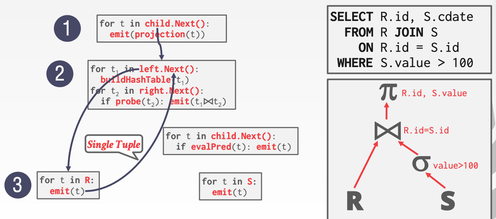
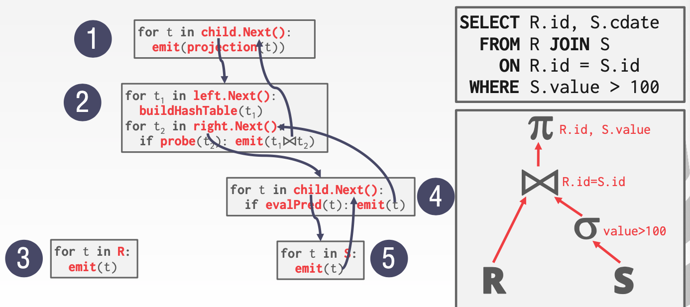
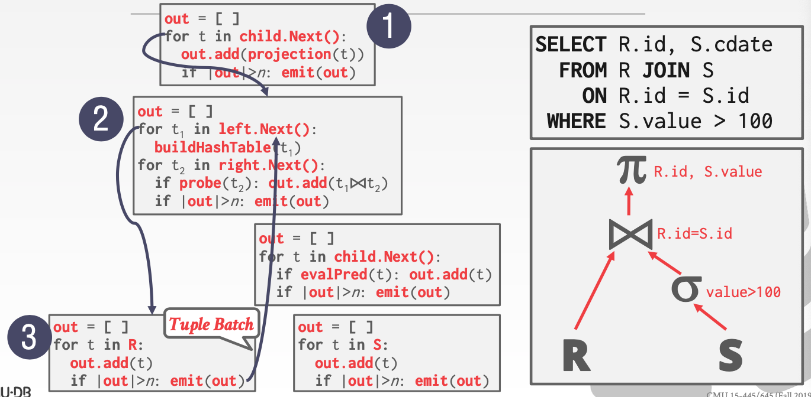
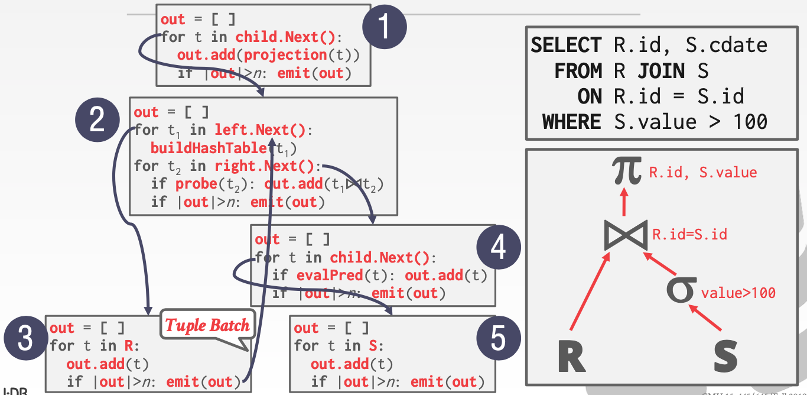
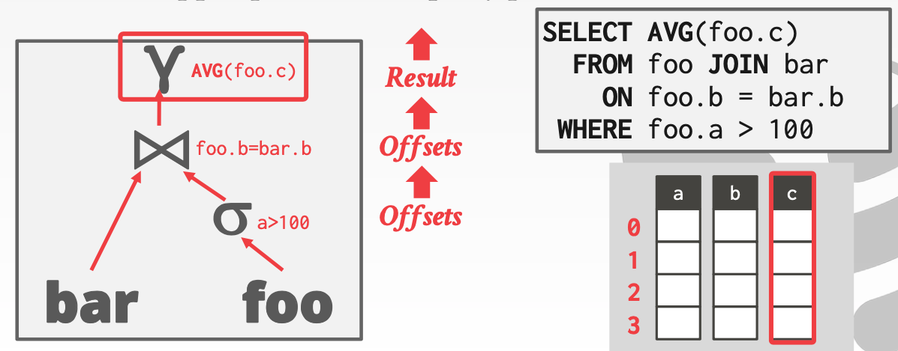
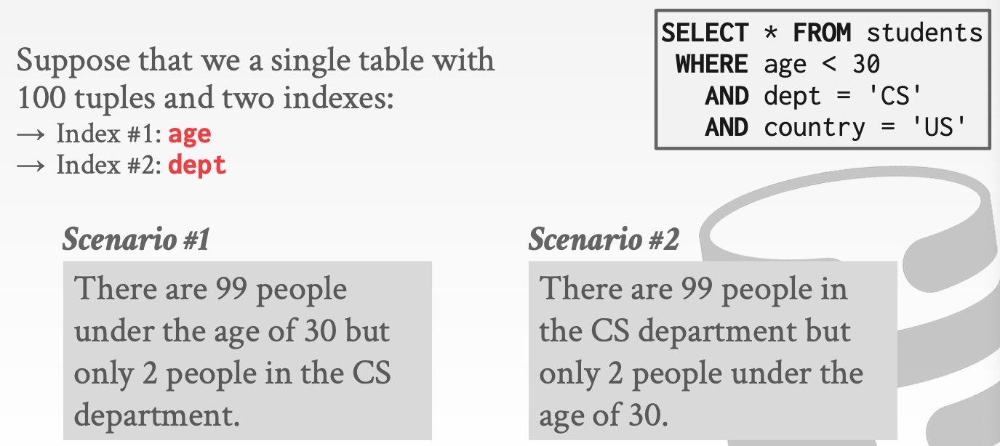
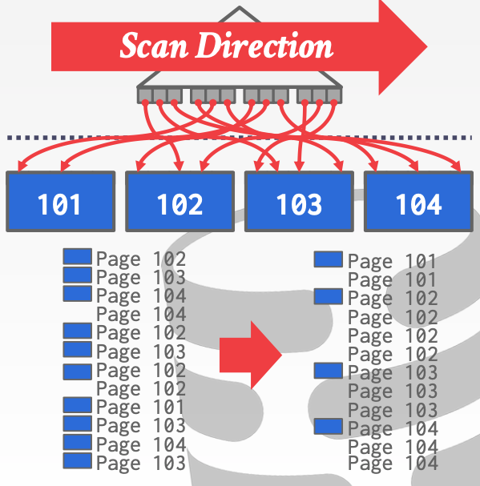
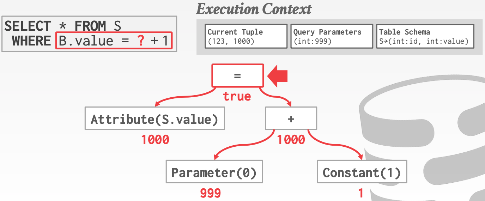

# Lecture 12 Query Execution - Part I

## Processing Model

* A DBMS's **processing model** defines how the system executes a query plan
  * Different trade-offs for different workloads

### Iterator Model

* Each query plan operator implements a **Next** function
  * On each invocation, the operator returns either a single tuple or a null marker if there are no more tuples
  * The operator implements a loop that calls next on its children to retrieve their tuples and then process them
  * Also callsed **Volcano** or **Pipeline** Model





* This is used in almost every DBMS
  * Allows for tuple **pipelining**
* Some operators have to block until their children emit all of their tuples
  * Joins, Subqueries, Order By
* Output control works easily with this approach

### Materialization Model

* Each operator processes its input all at once and them emits its output all at once
  * The operator "materializes" its output as a single result
  * The DBMS can push down hints into to avoid scanning too many tuples
  * Can send either a materialized row or a single column
* The output can be either whole tuples (NSM) or subsets of columns (DSM)


* Better for OLTP workloads because queries only access a small number of tuples at a time
  * Lower execution / coordination overhead
  * Fewer function calls
* Not good for OLAP queries with large intermediate results

### Vectorization Model

* Like the Iterator Mode where each operator implements a Next function in this model
* Each operator emits a batch of tuples instead of a single tuple
  * The operator's internal loop processes multiple tuples at a time
  * The size of the batch can vary based on hardware or query properties





* Ideal for OLAP queires because it greatly reduces the number of invocations per operator
* Allows for operators to use vectorized (SIMD) instructions to process batches of tuples

### Plan Processing Direction

* Approach #1: Top-to-Bottom
  * Start with the root and pull data up from its children
  * Tuples are always passed with function calls
* Approach #2: Bottom-to-Top
  * Start with leaf nodes and push data to their parents
  * Allows for tighter control of caches/registers in pipelines

## Access Methods

* An **access method** is a way that the DBMS can access the data stored in a table
* Three basic approaches:
  * Sequential Scan
  * Index Scan
  * Multi-Index / Bitmap Scan

### Sequential Scan

* For each page in the table:
  * Retrieve it from the buffer pool
  * Iterate over each tuple and check whether to include it
* The DBMS maintains an internal **cursor** that tracks the last page / slot it examined

```text
for page in table.pages:
	for t in page.tuples:
		if evalPred(t):
				// Do Something!
```

* Optimizations:
  * Prefetching
  * Buffer Pool Bypass
  * Parallelization

#### Zone Maps

* Pre-computed aggregates for the attribute values in a page
* DBMS checks the zone map first to decide whether it wants to access the page


#### Late Materialization

* DSM DBMSs can delay stitching together tuples until the upper parts of the query plan



#### Heap Clustering

* Tuples are sorted in the heap's pages using the order specified by a **clustering index**
* If the query accesses tuples using the clustering index's attributes, then the DBMS can jump directly to the pages that it needs

## Index Scan

* The DBMS picks an index to find the tuples that the query needs
* Which index to use depends on:
  * What attributes the index contains
  * What attributes the query reference
  * The attributes' value domains
  * Predicate composition
  * Whether the index has unique or non-unique keys



### Multi-Index Scan

* If there are multiple indexes that the DBMS can use for a query:
  * Compute sets of record ids using each matching index
  * Combine these sets based on the query's predicates (union vs. intersect)
  * Retrieve the records and apply any remaining predicates
* Postgres calls this Bitmap Scan
* Set intersections can be done with bitmaps, hash tables, or Bllom filters


#### Index Scan Page Sorting

* Retrieving tuples in the order that appear in an unclustered index is inefficient
* The DBMS can first figure out all the tuples that it needs and then sort them based on their page id



## Expression Evaluation

* The DBMS represents a `WHERE` clause as an **expression tree**
* The nodes in the tree represent different expression types
  * Comparisons (`=`, `<`, `>`, `!=`)
  * Conjunction (`AND`), Disjunction (`OR`)
  * Arithmetic Operators (`+`, `-`, `*`, `/`, `%`)
  * Constant Values
  * Tuple Attribute References



* Evaluating predicates in this manner is slow
  * The DBMS traverses the tree and for each node that it visits it must figure out what the operator needs to do
* A better approach is to just evaluate the expression directly
  * Think JIT compilation
