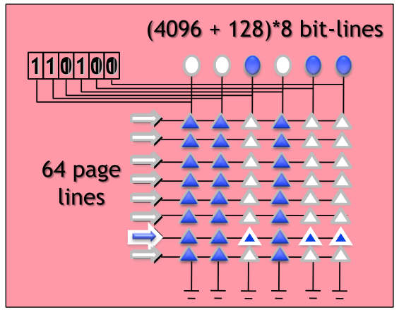
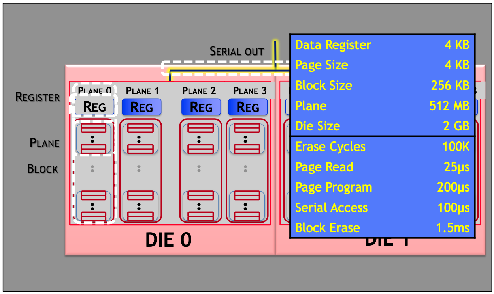
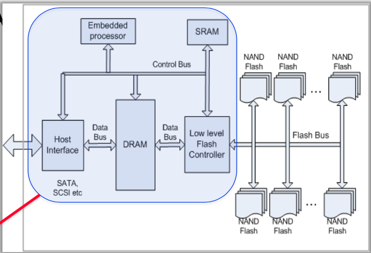

# Lecture 2 Solid-State Disks

## SSD Technologies

* **RAMdisks**: lots of DRAM together with a battery
  * Very expensive, very fast, limited poweroff data retention
    * but, coupled with a disk, battery can allow saving of all data
* **Flash**: Flash != SSD, but most SSD is NAND flash
  * **NOR**: lower density, word accessible, slow write, ~EEPROM
  * **NAND**: write in pages, erase in blocks of pages
* Emerging technologies of note (a.k.a. NVM or SCM)
  * Currently cost as much or more than DRAM

## NAND Flash SSDs

### NAND Flash Circuits

* Add a “floating gate” in a MOSFET cell, insulating it so charge on Floating Gate persists without voltage Vg applied to control gate above it
  * Lasts maybe a year = "long" DRAM refresh
* Read: apply a little control voltage & stored charge
* Erased (1) uses large (-) voltage to flush charge
* Programmed (0) applies large positive voltage to inject charge
* Reading & Writing "wears out" insulation around floating gate

### Flash Storage Organization

* A flash block is a grid of cells (one page per row)
  * Erase: Tunneling releases charge from all cells (Cannot reset bits to 1 except with erase)
  * Program: Tunneling injects charge into some cells
  * Read: NAND operation with a page selected
  * 128 bytes per page hidden for Error Correction Code (ECC), addressing
* A page is the smallest unit for programming and reading, while a block is the smallest unit for erasing
* Planes are parallel in each die, but at most one place performing some operations at one time

### NAND Flash SSD is a little computer

* Storage: flash chips
* Access: multiple independent access channels
* Interface: e.g., SATA
* Controller: computer + RAM
  * Processes cmds
  * Drives channels
  * Write behind
  * Allocation
  * Wear leveling

