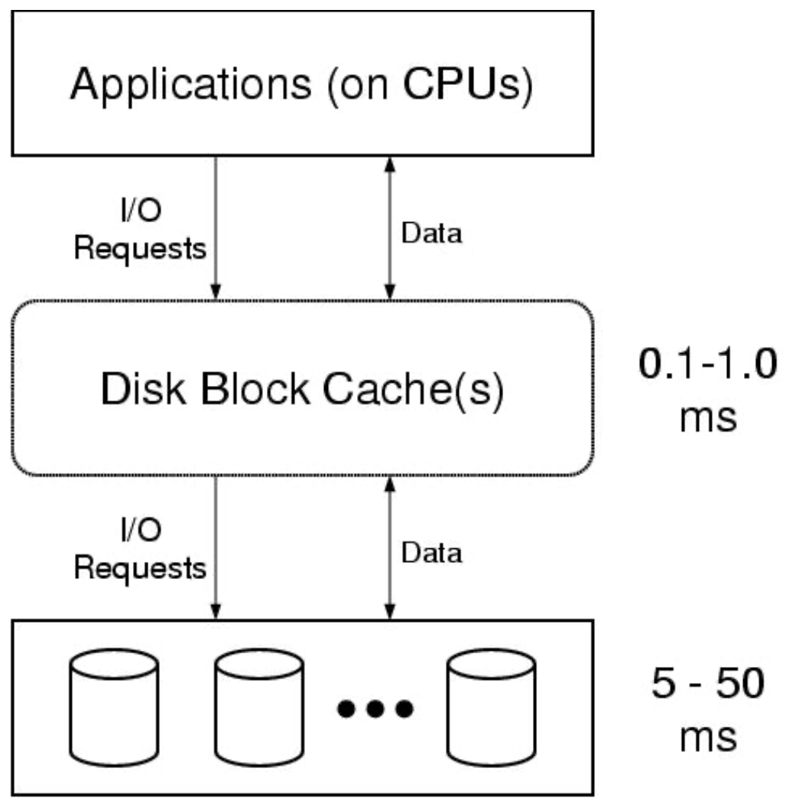

# Lecture 6 Caching and FS Integrity

## Storage Cache

### Disk Block Caching

* A few very expensive accesses dominate average
* Miss Ratio is a more useful concept than Hit Ratio
  * halving miss ratio can nearly halve average
* Among read requests
  * reads for which not all data is in cache
  * prefetches go to disk but in the background
* Among write requests
  * just put new data into cache and move on
  * writer only waits if no cache space is available for new data
    * or if only read existing block because only subset being written

### Challenges to Internal Consistency

* Concurrent modifications
  * Two processes or systems could induce race conditions
  * Solution: proper use of concurrency control mechanisms
* Media defect growth
  * contents of newly-defective sectors are lost
  * Solution: redundancy of some sort
* Transient storage subsystem oopsies
  * flipped bits on bus, writes to wrong sector
  * Solution: integrity checks plus redundancy
* System crashes
  * volatile main memory contents lost upon system failure
    * only the stuff on stable storage is there upon restart
  * such failures are unpredictable and can happen at any time
  * Solution: on-disk image must always be sufficiently consistent

### Tools for Protecting Internal Consistency

* static mappings
  * if they do not change, they do not cause problems
* "atomicity" of writes
  * a la the tri-state post-write guarantee of per-sector ECC
* update ordering
  * simply ensuring that one update propagates before another
* real atomicity
  * ensuring that a set of updates all occur or none do

#### "Atomicity" of Writes as a Tool

* Unwritten guarantee provided by per-sector ECC
  * because the ECC check will fail if only partially written
* Same trick (checksum) can be used by FS or app
* Good for grouping inter-related updates
  * but increases likelihood of data loss due to the third state